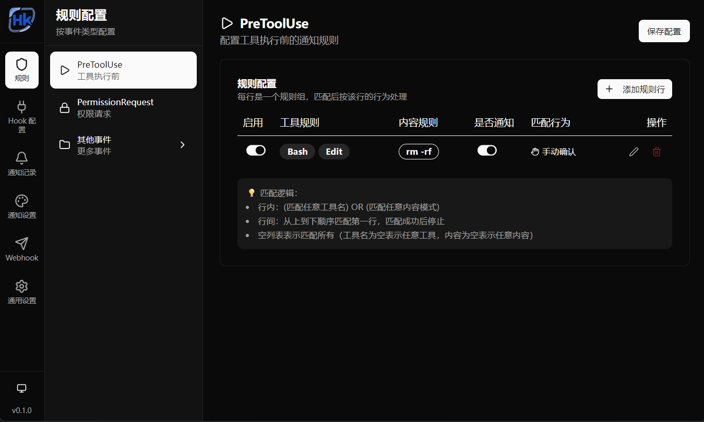

# Agent HK

Claude Code Hook 可视化管理工具。通过桌面通知实时监控 Claude Code 的工具调用，支持自定义规则进行拦截、放行或通知。



## 功能

- **PreToolUse 规则** — 按工具名称和内容模式匹配，支持手动确认、自动放行、自动拒绝、仅通知
- **其他事件监听** — 支持 PostToolUse、Stop、SessionStart/End 等 16 种 Hook 事件
- **桌面通知** — 可配置通知位置、屏幕、主题（亮/暗）
- **Webhook 转发** — 将事件转发到钉钉/飞书等 Webhook，支持自定义模板
- **通知记录** — 查看所有 Hook 请求的历史日志
- **通用设置** — 开机自启、最小化到托盘

## 技术栈

- **前端**: React 19 + TypeScript + Tailwind CSS 4 + shadcn/ui
- **后端**: Tauri 2 + Rust + Actix-web
- **桌面**: 系统托盘、多显示器支持、透明通知窗口

## 开发

```bash
# 安装依赖
pnpm install

# 启动开发
pnpm tauri dev

# 构建
pnpm tauri build
```

## 配置

配置文件存储在 `~/.config/agent-hk/config.json`。

### Claude Code 集成

在 Claude Code 的 `settings.json` 中添加 Hook 配置，将事件发送到 Agent HK 的本地 HTTP 服务：

```json
{
  "hooks": {
    "PreToolUse": [
      {
        "type": "command",
        "command": "curl -s -X POST http://127.0.0.1:23816/hook -H 'Content-Type: application/json' -d '$HOOK_DATA'"
      }
    ],
    "Stop": [
      {
        "type": "command",
        "command": "curl -s -X POST http://127.0.0.1:23816/hook -H 'Content-Type: application/json' -d '$HOOK_DATA'"
      }
    ]
  }
}
```

支持的事件类型: `PreToolUse`, `PostToolUse`, `PostToolUseFailure`, `Notification`, `Stop`, `SessionStart`, `SessionEnd`, `SubagentStart`, `SubagentStop`, `TeammateIdle`, `TaskCompleted`, `PreCompact`, `WorktreeCreate`, `WorktreeRemove`, `InstructionsLoaded`, `ConfigChange`, `UserPromptSubmit`

## License

MIT
